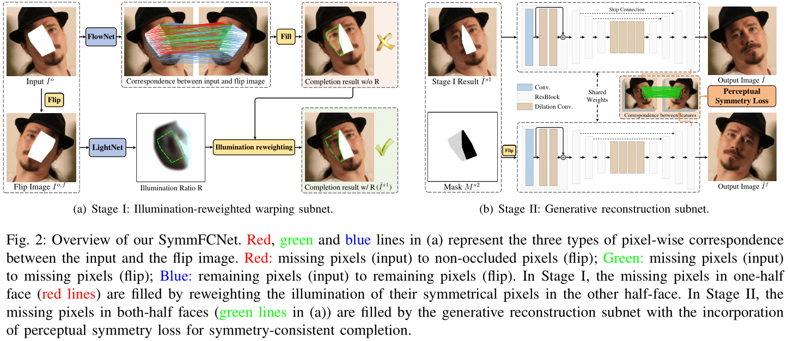

# [SymmFCNet](#)
 Pytorch implementation for [Learning Symmetry Consistent Deep CNNs for Face Completion](#)
 
 # SymmFCNet framework
Overview of our SymmFCNet. <B>Red</B>, <B>green</B> and <B>blue</B> lines represent the pixel-wise correspondence between the input and the flip image. 
- <B>Red</B>: missing pixels (input) to non-occluded pixels (flip); 
- <B>Green</B>: missing pixels (input) to missing pixels (flip); 
- <B>Blue</B>: remaining pixels (input) to remaining pixels (flip).

 # Pytorch source code and models will come soon.
